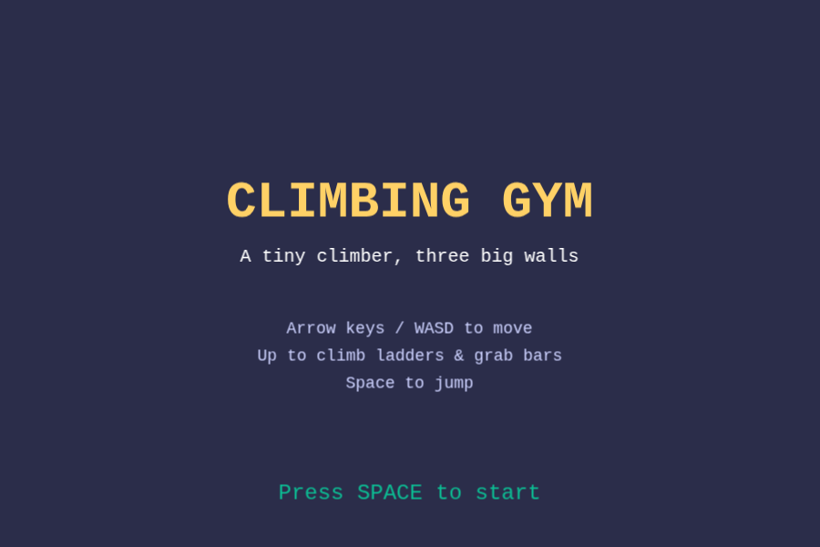
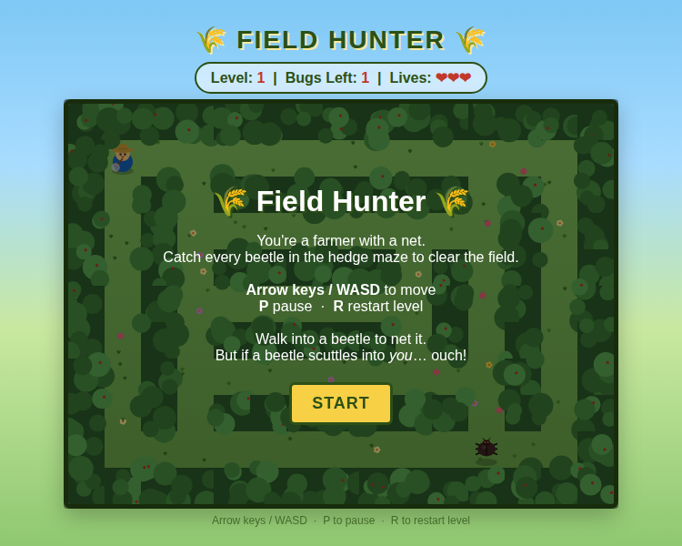
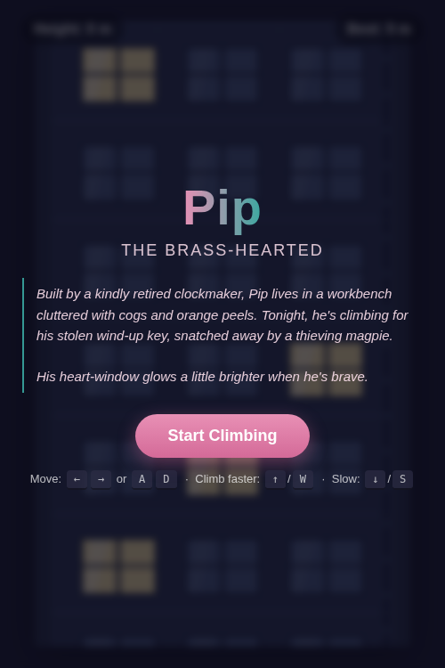
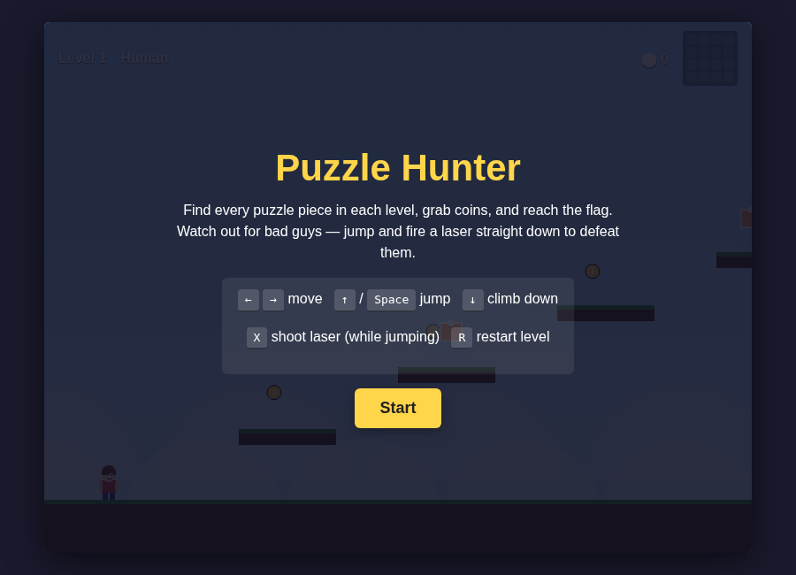
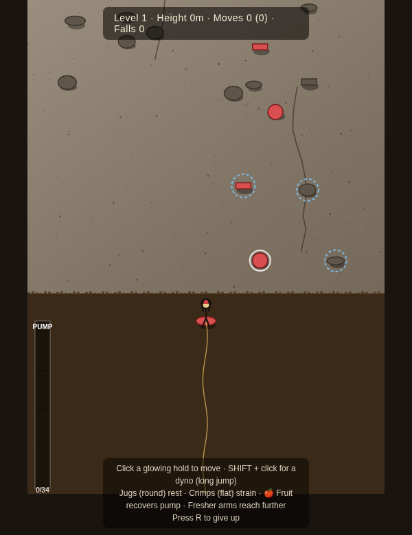

# Games Games Games

These are a collection of games developed together with my kids — a small
experiment to get them thinking about game design, character development, and
mechanics. They are in varying states of completeness, and entirely optimizing
for fun (as defined by a 4 year old).

---

## Climbing Gym

A platform game set inside a colorful climbing gym (think Hapik in Industry
City). Guide a blond 4-year-old through three increasingly tricky walls,
jumping between platforms, climbing ladders, hanging from bars, and squeezing
through tubes. Reach the top of each wall to trigger a confetti explosion —
then it's on to the next climb. Built with Phaser 3.

> **Note:** Because the game uses ES modules you need to serve it over HTTP.
> From the `climber/` directory run `python3 -m http.server 8000` (or
> `npx serve .`) and open `http://localhost:8000`.

**Controls:** Arrow keys / WASD to move · Up to climb ladders & grab bars · Space to jump

---

## Field Hunter

Navigate a hedge maze and catch every beetle before it catches you. Move
through the grass paths, walk into a beetle to net it, but watch out — if one
scuttles into you first, you lose a life. Each of the four levels introduces
more beetles and trickier maze layouts. Fast, arcade-style, and surprisingly
tense.

**Controls:** Arrow keys / WASD to move · P to pause · R to restart level

---

## Pip the Brass-Hearted

An endless vertical climber starring Pip — a clockwork-hearted little figure
built by a kindly retired clockmaker who is trying to recover a stolen
wind-up key from a thieving magpie. Run left and right, climb faster by
holding Up, and see how high you can get before Pip falls. Your best height
is saved so there is always a score to beat.

**Controls:** Left / Right (or A / D) to move · Up / W to climb faster · Down / S to slow

---

## Puzzle Hunter

A side-scrolling platformer where the goal is to collect every puzzle piece
hidden across each level, grab coins along the way, and reach the flag to
advance. Bad guys patrol the platforms — you can defeat them by jumping and
firing a laser straight down. As puzzle pieces are collected they reveal a
hidden image, piece by piece.

**Controls:** Arrow keys to move · Up / Space to jump · Down to climb down · X to shoot laser · R to restart level

---

## Big Wall

A turn-based rock climbing puzzle game set on a towering granite wall straight
out of Yosemite. Plan each move carefully: click a glowing hold to shift your
weight to it, or hold Shift and click for a risky dyno (long jump). Different
hold types affect how quickly your forearms pump out — round jugs let you rest,
flat crimps drain you fast. Fruit scattered on the wall restores pump. Fall too
many times and the level resets. Complete the route to unlock the next level.

**Controls:** Click a glowing hold to move · Shift + click for a dyno · R to give up

